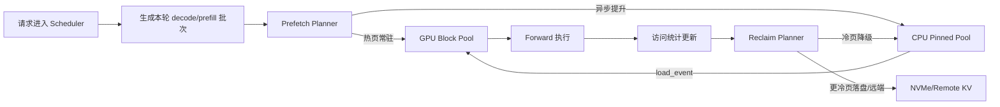
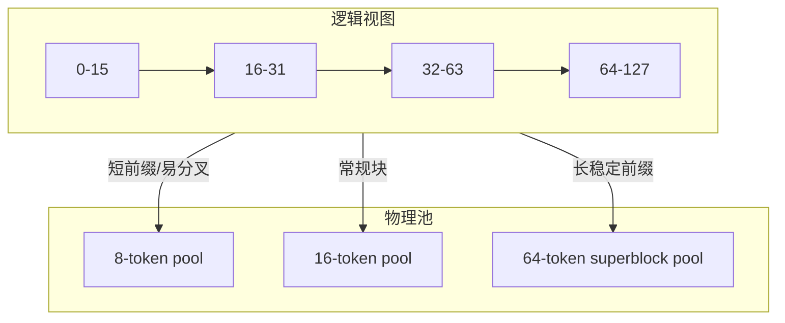
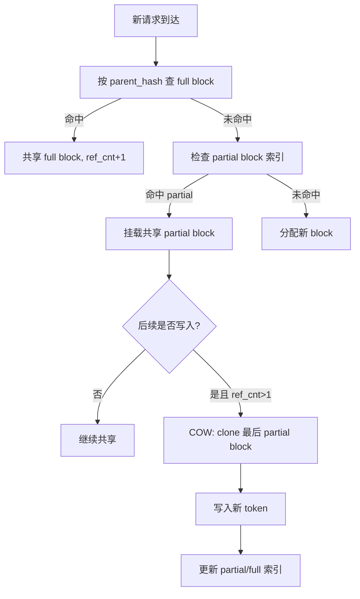

# 将操作系统资源管理映射到 nano-vllm 与 vLLM 的高价值优化清单

## 执行摘要

这份报告的核心判断是：**如果你的目标是“做出能写进简历、又有较高把握拿到可见收益”的改进，最值得优先投入的不是再发明一套全新的 attention kernel，而是把操作系统里已经被反复验证的“分层存储、页大小分级、共享与写时复制、热度感知回收、优先级/QoS 调度、NUMA 放置”迁移到 KV cache 与调度层**。原因很直接：nano-vllm 当前已经把 PagedAttention 的几个关键抽象暴露得非常清楚——`BlockTable` 就像页表，`BlockManager` 就像物理页分配器，`prefix_cache` + `ref_count` 就像共享页，`Scheduler` 已经有优先级、抢占和 chunked prefill，而 `paged_attention()` 还是一个纯 PyTorch 的“先 gather 非连续块，再做常规 attention”的教学实现，因此**在分配/布局/调度层做文章，能比纯 kernel 微调更快做出可衡量结果**。

从“可行性 × 创新性 × 收益 × 简历亮点”四个维度综合考虑，我最推荐你优先做三类工作。第一类是**热冷分层 KV cache + 异步预取/回收**：把 GPU 看作主存、CPU pinned memory 看作 swap cache、必要时再加 NVMe/远端作为次级存储，并做热度感知的 promotion/demotion；这条线与 vLLM 现有的 `simple_kv_offload`、`kv_offloading_backend`、LMCache/InfiniGen 的经验高度一致，论文与官方文档已经证明“KV offload + 预取 + pipelining”是有明显收益的。第二类是**混合页大小/超级块 PagedAttention**：把今天固定 `block_size` 的设计推广到“小 hash 粒度 + 大物理页粒度”，类似 THP/huge page 与 segmentation 的结合，用更大的超级块承载长前缀或 decode-hot 区域，从而减少 block table 元数据、gather 次数和内存碎片。第三类是**前缀共享的 Copy-on-Write 与更聪明的回收策略**：vLLM 现在已经有“只缓存 full block、基于双向链表 free queue 的 LRU prefix cache”，nano-vllm 也已经有 `prefix_cache`、反向映射和引用计数；在这之上加“部分块 COW、2Q/多代 LRU、子块级共享”是很自然的升级。

如果你的目标是**最快做出简历可写成果**，建议路线是：先在 nano-vllm 上完成一个能够跑通、指标漂亮的原型，再把接口设计迁移到 vLLM 的现有抽象上。更具体地说：**第一阶段做 QoS/优先级调度 + 2Q/LRU 回收 + NUMA 感知 offload**，容易做、容易出图；**第二阶段做热冷分层 KV + 预取**，最容易拿到“显著降低显存占用/提升长上下文吞吐”的结果；**第三阶段做混合页大小/超级块**，这是最像“系统优化项目”的简历亮点；如果时间和能力再往上走，最后再挑战 **vAttention 风格的连续虚拟 KV 映射**。vAttention 论文已经表明，利用 CUDA VMM 维持 virtual contiguous / physical paged 的设计，在某些场景下可以比 PagedAttention kernel 再快到 1.23×；但这条线更适合作为“冲高亮点”，不适合作为第一枪。citeturn30view0turn20search0turn20search4

## 当前实现与设计约束

先看 **nano-vllm**。它把 PagedAttention 的 OS 类比写得非常直接：`Block` 是固定大小的 KV 页，`BlockTable` 负责把“逻辑块索引”映射到“物理 block ID”，注释里甚至明确说它“就像虚拟内存里的 page table”；`BlockManager` 用一个 LIFO `free_blocks` 栈做 O(1) 分配/回收，并维护 `prefix_cache: (parent_hash, token_tuple) -> block_id` 和 `_block_to_cache_key` 反向映射来支持 prefix sharing 与 O(1) 删除；`BlockKVCache` 物理布局是 `[num_layers, num_blocks, block_size, num_kv_heads, head_dim]`，属于“全局块池 + 每序列 block table 引用”的经典 paged KV 设计。citeturn36view0turn41view0turn37view2

但它目前的 **性能瓶颈也很清楚**：`paged_attention()` 还是纯 PyTorch 教学实现，核心逻辑是“根据每个序列的 `block_table`，逐 token 从非连续 block 中 gather K/V 到连续 buffer，再做常规 scaled dot-product attention”；而且 gather 代码是 Python 循环按 `pos -> logical_block -> physical_block -> slot` 一项项复制。这意味着：**任何能减少 gather 次数、提高局部连续性、降低 block-table 查找频率的 trick，在 nano-vllm 上都可能有放大收益**。citeturn42view0

再看 **nano-vllm 的调度器**。它已经支持 `FCFS` / `PRIORITY`，并实现了“高优先级新请求到来时，对低优先级运行中请求做 recompute-based preemption”、`chunked prefill`、`max_prefill_tokens` 限流，以及“新请求准入时按完整 prompt 需要的 blocks 做 admission check，防止 admitted 之后饿死”的逻辑。这些抽象非常适合承接 OS 风格的 **priority scheduling、reserve quota、lottery ticket、QoS isolation**。citeturn38view1turn38view2

而 **vLLM** 已经在这些方向上走得更远。它的 V1 `KVCacheManager` 和 `BlockPool` 预先分配 block pool，并在 block 上直接挂双向链表指针构造 free queue，使中间移动到队尾可以是 O(1)；prefix cache 使用 full block 缓存、块 hash 由“父块 hash + 当前块 token + extra hashes”组成，缓存命中时通过 `touch()` 提高引用并可能从 free queue 中拿掉，释放时则把块按“更不可能被复用的后缀块优先淘汰”的顺序回收到 free queue，淘汰策略本质上是 LRU。citeturn23view1turn24view0turn22view1turn22view2

vLLM 同时还提供了几个非常值得借力的接口锚点。其一，`CacheConfig.hash_block_size` 明确允许“**prefix-caching 的 hash 粒度细于物理 KV block 粒度**”，只要后者是前者的整数倍；这几乎就是为“混合页大小/超级块”预留的扩展点。其二，`KVCacheManager.allocate_slots()` 支持 `num_lookahead_tokens`、`reserved_blocks`、`full_sequence_must_fit`，而且文档明确说明 `reserved_blocks` 用来给其他 in-flight sequence 留空间、`full_sequence_must_fit` 用来防止 chunked prefill 过度准入导致 KV thrashing。其三，vLLM 已经有 `simple_kv_offload` 和 CLI 级 `kv_offloading_backend` / `kv_offloading_size`，并且 offload manager 里已经有 load/store 事件、CPU/GPU touch refs、lazy store near eviction 等机制。其四，vLLM 已经支持 FP8 KV cache。换句话说：**很多 OS 类 trick 在 vLLM 不是“从 0 到 1”，而是“沿着现有接口从 1 到 1.5/2”**。citeturn35view0turn24view3turn24view4turn22view6turn33view0turn33view1turn27view1turn27view2turn28view0

最后一个重要约束是：**vLLM 的生产 kernel 已经为 paged KV 布局做了大量内存访问优化**。官方设计文档给出的核心布局是 `k_cache [num_blocks, num_kv_heads, head_size/x, block_size, x]` 与 `v_cache [num_blocks, num_kv_heads, head_size, block_size]`，并强调通过邻近线程读邻近内存来实现 memory coalescing。因此，把原型从 nano-vllm 迁移到 vLLM 时，最有价值的往往不是 Python 侧 gather 消除，而是“页大小、回收策略、offload/prefetch、prefix sharing、QoS 调度”这些**不会与底层 kernel 优化冲突的系统层改动**。citeturn21view4turn26view0turn26view1

## 可行 trick 全景清单

下表把最值得考虑的 trick 按“OS 对应机制、落地方式、收益、难度、风险”做了对比。表中的收益区间是**工程保守预估**，不是官方已公布数字；我会在后文说明这些预估的依据分别来自 vLLM/LMCache/InfiniGen/vAttention/OS 机制本身。citeturn29view2turn29view3turn30view0turn10search0turn8search3

| Trick | OS 类比 | 在 nano-vllm 中的实现抓手 | vLLM 可借用接口/现状锚点 | 预期收益 | 难度 | 主要风险 | 推荐度 |
|---|---|---|---|---|---|---|---|
| 热冷分层 KV cache + 异步预取/回收 | 分页 + 交换 + readahead + page cache | 给 `Block` 增加 `tier/hotness/last_access/pin_count`；GPU/CPU 双 block pool；decode 前批量 prefetch，evict 时异步 demote；调度器额外维护 prefetch window | `simple_kv_offload` 已有 load/store event、CPU/GPU touch refs；CLI 已支持 `kv_offloading_size/backend` citeturn33view0turn33view1turn27view1turn34search8 | 显存占用显著下降；长上下文吞吐与可服务并发提升；对 OOM 最敏感 | 中 | PCIe/CPU 带宽成为瓶颈；热度预测失误会拉高 ITL | **极高** |
| 混合页大小/超级块 PagedAttention | THP/huge page + 段页式管理 | `BlockTable` 从 `block_id` 扩成 `BlockRef(size_class, base_block, offset)`；小 `hash_block_size` + 大物理页；长前缀合并为 superblock | `hash_block_size` 已允许 hash 粒度小于物理块；Hybrid KV Cache Manager 已支持多 group / 统一 page size 思路 citeturn35view0turn35view1turn34search4 | 减少 block 元数据与 gather 次数；降低碎片；长 prompt/长会话收益明显 | 中高 | 内碎片可能反噬；kernel 侧要适配 size class | **极高** |
| 前缀共享 COW + 子块级去重 | 共享页 + Copy-on-Write | 最后一个未满块允许“共享只读”；发生 append 且 `ref_count>1` 时 COW；prefix 索引由 full-block 扩到 sub-block | vLLM 当前只缓存 full block，已有 parent-hash 链、`ref_cnt`、`touch()` 与 LRU free queue citeturn23view1turn23view2turn22view1turn22view2 | 重复系统提示、多轮会话、agent 树状分叉场景下显著省显存/降 TTFT | 中 | 正确性细节多；部分块 hash/一致性维护复杂 | **很高** |
| 2Q / Multi-Gen LRU 前缀回收 | 页置换算法 | 给 block 加 generations/hit_count；把 free queue 扩成 hot/cold 两队列或多代 | 当前 vLLM eviction 近似 LRU；Linux Multi-Gen LRU 与 OSTEP LRU 是成熟参考 citeturn23view1turn9search1turn16view3 | prefix hit rate 提升，长尾场景比纯 LRU 更稳 | 低中 | 指标复杂，若工作集很小收益有限 | **很高** |
| QoS / 优先级 / 票据调度 + KV 额度保留 | MLFQ / lottery / cgroups QoS | 在 `Scheduler` 上增 `req_class`、per-class token budget、`min_decode_share`、`reserved_blocks_by_class` | nano-vllm 已有 priority/preemption/chunked prefill；vLLM 已有 `priority` policy、`reserved_blocks`、`full_sequence_must_fit` citeturn38view1turn25search0turn24view3turn24view4 | P95/P99 ITL、SLO、混部稳定性明显改善 | 低中 | 平均吞吐可能略降；策略参数较多 | **很高** |
| NUMA 感知 CPU offload / pinned buffer 放置 | NUMA policy / auto NUMA balancing | 按 GPU 所在 PCIe root complex 绑定 CPU offload 线程和 pinned pool；用 first-touch/mbind 风格策略 | Linux NUMA policy/auto balancing 文档明确支持按 node 放置和迁移内存 citeturn17search1turn17search3turn17search14 | 多路 CPU + 多 GPU 主机下，offload 带宽和尾延迟显著更稳 | 中 | 单路机收益很小；平台依赖大 | **高** |
| 冷页压缩 / zswap 式 KV offload compression | zswap / zram / compressed swap cache | 仅对 CPU/NVMe cold tier 做 FP8/int8/块压缩；prefetch 时解压；hot tier 保持高精度 | vLLM 已支持 FP8 KV；zswap/zram 证明“CPU cycles 换 I/O”是可行设计 citeturn28view0turn10search0turn10search2 | CPU/远端 KV 容量扩大，传输字节数下降 | 中高 | 精度/反量化开销；实现复杂 | **高** |
| Buddy / slab 风格分配器 | 空闲空间管理 / buddy allocator | 把 block 元数据、prefetch buffer、gather workspace、pinned staging buffer 统一到 size-class pool | OSTEP 讨论了 best-fit/first-fit/buddy 的碎片与查找开销权衡；CUDA 也有 stream-ordered allocator citeturn16view0turn16view1turn20search1turn20search5 | 减少碎片与分配同步；对异步 offload 特别重要 | 中 | 对主路径收益通常不如前 5 项 | **中高** |
| mmap / 页面缓存式前缀快照与懒加载 | mmap + demand paging + userfaultfd | 常见 system prompt / prefix 预制成磁盘快照；启动后 mmap 并懒加载到 CPU tier | `mmap()`、`madvise()`、`readahead()` 都是成熟机制；vLLM 也有 safetensors prefetch 参数 citeturn19search1turn19search0turn18search0turn27view0 | 冷启动、重复大前缀场景收益可观 | 中高 | 工程复杂；与 tokenizer/frontend 流程耦合 | **中** |
| vAttention 风格连续虚拟 KV 映射 | 虚拟内存地址保留 + 按需映射 | 自定义 CUDA extension，保留连续 VA、按需 map 物理页，减少不连续布局带来的 kernel 开销 | CUDA VMM 官方 API 可做地址保留/映射；vAttention 实证可到 1.23× citeturn20search0turn20search4turn30view0 | 理论上最漂亮，也最像论文题目 | 高 | 需要 CUDA 低层开发；和现有 kernel 深耦合 | **中高** |
| 零页/延迟物化 KV block | demand-zero page / lazy allocation | `BlockKVCache` 从全量 `torch.zeros` 改为 `torch.empty` + 有效位图 + 首写初始化 | nano-vllm 当前在构造时一次性 `torch.zeros` 整个 block pool citeturn37view2 | 降低启动开销与无效触碰带来的显存压力 | 低 | 运行期收益有限，更多是工程卫生 | **中** |

一个很重要的观察是：**vLLM 官方自己已经把 PagedAttention 描述为“受虚拟内存/分页启发”的系统**，而且其后续演进（prefix cache、hybrid KV cache manager、offload、chunked prefill、priority scheduling）本身就是在继续走“OS 化”的路线。因此，把这些想法继续往 OS 经典机制上推，并不是“脱离生态自嗨”，而是顺着它已有方向前进。citeturn29view1turn21view3turn25search14

## 优先 trick 设计草图

### 热冷分层 KV cache 与异步预取

**原理概述。** 这条线最像传统 OS 的“主存 + swap + page cache + readahead”。GPU block pool 只保留活跃工作集；温数据放在 CPU pinned memory；更冷的数据可以落 NVMe 或远端 cache。decode/prefill 之前，调度器根据“接下来会访问哪些 block”发起异步 prefetch；GPU 容量紧张时，选择冷页 demote；对即将被逐出的 GPU block，可做 lazy-store，尽量与计算并行。Linux 的 `readahead()`、`posix_fadvise(SEQUENTIAL)`、swap readahead、zswap，以及 vLLM/LMCache/InfiniGen 的 KV offload 都在证明：**正确的预取/分层策略，往往比单纯扩大高层存储更划算**。citeturn18search0turn18search2turn18search4turn10search0turn21view2turn29view2turn29view3

**OS 类比。**  
在 OS 视角里，你可以把：
- `BlockTable` 看成页表；
- GPU blocks 看成 DRAM resident pages；
- CPU pinned blocks 看成 swap cache / page cache；
- NVMe/远端 KV 看成后备存储；
- prefetch window 看成 readahead window；
- eviction policy 看成 page reclaim policy；
- `pin_count` 看成 mlock/unevictable 页面。citeturn36view0turn18search0turn9search1turn9search4

**nano-vllm 具体实现思路。**  
数据结构上，建议把 `Block` 扩成：

```python
@dataclass
class Block:
    block_id: int
    block_size: int
    ref_count: int
    prefix_hash: Optional[int]
    is_full: bool
    tier: Literal["gpu", "cpu", "nvme"]
    hotness: int
    last_access_step: int
    pin_count: int
    dirty: bool
    cpu_shadow_id: Optional[int]
```

`BlockManager` 拆成 `GpuBlockPool` 和 `ColdBlockPool`，再增加 `TransferManager`：维护 `promote_queue`、`demote_queue`、`prefetch_queue`、`inflight_events`。`Scheduler.schedule()` 在产出 decode/prefill batch 之后，先调用 `plan_prefetch(batch)`，为当前 step 会触达的 prefix blocks 和即将写入的新 blocks 提前发起加载。对于 decode，每个 step 至少会扫过完整 context；对长上下文，最好同时维护“最近 K 个 step 的 block heat map”，让最热块常驻 GPU。接口上可以在 `LLMEngine.step()` 里插入三个 hook：`before_schedule_reclaim()`、`after_schedule_prefetch()`、`after_forward_demote()`。citeturn36view1turn41view0turn38view1

**vLLM 对应落点。**  
vLLM 已有 `simple_kv_offload`：scheduler 侧 manager 会构造 `load_event`/`store_event`，跟踪 `load_gpu_blocks`/`load_cpu_blocks`，并在请求结束或更新时清理 CPU/GPU touch refs；lazy store 明确就是“单次 cursor walk，把接近 eviction 的 cached GPU block offload 出去”。这意味着你完全可以把“更聪明的热度预测、2Q 置换、prefetch batching、NUMA-aware CPU tier”封装成现有 offload manager 的增强版，而不必大动 `Scheduler` 主框架。citeturn22view6turn33view0turn33view1turn33view3turn33view5



**预期收益。**  
如果只看公开结果，LMCache 在多种模型与负载下报告了明显优于 naive vLLM 的 TTFT、ITL 和吞吐，某些配置下可以到 1.3–3×，低 QPS 某些模型甚至更高；InfiniGen 在 offloading-based 系统上报告“选择性 prefetch + ephemeral pruning”可带来最高约 3× 性能提升；但这些数字包含不同系统与更大规模部署效应，直接移植到单机 nano-vllm/vLLM 不应等比例照搬。更保守的工程预估是：**GPU KV 显存压力可下降一个量级感知上的大幅度，长上下文吞吐通常有 10%–40% 提升空间，尤其在本来就受限于显存容量/抢占/频繁 OOM 的场景里**。citeturn29view2turn29view3

**实现难度与风险。**  
难度我给“中”。主要风险不是正确性，而是**热度预测失误导致 prefetch 无效、PCIe 往返放大 ITL**。所以这条线要把“promotion/demotion 字节数、prefetch 命中率、stall 时间、CPU/GPU 带宽利用率”作为一等指标，不要只看 tokens/s。citeturn18search0turn18search4turn29view3

### 混合页大小与超级块 PagedAttention

**原理概述。** 这条线对应 OS 里的 THP/huge page、段页式管理和多级页表：对短生命周期、随机访问、容易共享的小前缀用小页；对长前缀、稳定系统提示、decode-hot 的大段上下文用大页/超级块。这样做的目的不是神秘的“更加高级”，而是四个很朴素的收益：**减少 block table 长度、减少 prefix hash 元数据、减少 gather 次数、减少 allocator 的外碎片**。Linux THP 文档强调 huge page 的价值在于“大工作集应用里页大小自动 promotion/demotion 带来的性能收益”；vLLM 这边则已经公开支持“hash 粒度小于物理 KV block 粒度”，以及多 group 但统一 page size 的 hybrid manager。citeturn8search3turn35view0turn35view1

**OS 类比。**  
你可以把它类比为：
- 小 `hash_block_size` = 基础页；
- 物理 `block_size` = 可 promotion 的大页；
- `SegmentDirectory` = 段表 / 二级页表；
- prefix-stable long range = THP 的 promotion 候选区；
- split superblock = huge page demotion。citeturn8search3turn15view0turn16view8

**nano-vllm 具体实现思路。**  
第一步，不要再让 `BlockTable` 只存 `block_id: List[int]`，改成：

```python
@dataclass
class BlockRef:
    size_class: int           # 8 / 16 / 32 / 64 tokens
    physical_block_id: int
    base_token: int
    valid_tokens: int
    prefix_hash: Optional[int]
```

然后把 `BlockTable` 变成“逻辑区间 -> BlockRef”的有序表，优先按 8-token 或 16-token 粒度算 hash，但允许把连续 4 个 16-token block 合并成一个 64-token superblock。物理内存布局可以做成“统一 superpage 池 + 小页子分配”，也可以做成多个 size-class 空闲链表。对 nano-vllm 来说，最现实的第一版是**多个 size-class 独立池**，因为实现最简单；第二版再做 superblock split/merge。`paged_attention()` 则改为按 `BlockRef` 做 block-range gather，而不是按 token gather。这样即使仍是 PyTorch，也能把最差的逐 token Python 循环削弱很多。citeturn42view0turn36view0turn41view0

**vLLM 对应落点。**  
vLLM 已有两个非常关键的锚点。第一，`hash_block_size` 已经允许“prefix-caching keys 在更细粒度上计算，再合并到更大的物理 blocks”；第二，`BlockHashListWithBlockSize` 就是为不同 block size group 做 hash granularity conversion 的工具。这说明“**小 hash 粒度 + 大物理页粒度**”不只是你的想象，而是代码接口已经在接近这个方向。更进一步，Hybrid KV Cache Manager 之所以存在，本质上就是在解决“不同 layer type 的有效 page size/slots 需求不同，但还要共用一个高效内存池”的问题；把“attention type 异构”推广到“size class 异构”，在工程上非常自然。citeturn35view0turn21view6turn35view1



**预期收益。**  
这条线的收益不像 offload 那样“立刻看见显存下降很多”，但它很适合打“系统设计”亮点。保守预估是：**长 prompt 与高 prefix-reuse 场景中，显存利用率可改善 5%–15%，TTFT/ITL 可能有 5%–20% 的改善，尤其在 nano-vllm 上由于原始 gather 很粗糙，收益可能更明显**。但要注意，内部碎片会反噬；因此这条线必须做 size-class 占用率与 fragmentation ratio 的 ablation。其理论依据来自 THP 本身、vLLM 对 finer hash granularity 的原生支持，以及 nano-vllm 当前逐 token gather 的低效。citeturn8search3turn35view0turn42view0

**实现难度与风险。**  
难度我给“中高”。如果只做 Python 侧 prototype，其实不难；但如果你想把它真正落到 vLLM production kernel，就要解决 size-class 下的 kernel indexing、cacheline 对齐、可能的 kernel specialization 爆炸等问题。一个务实建议是：**先只做 16/64 两档，不要一开始就做 4 档甚至动态连续空间拼接**。citeturn21view4turn26view1

### 前缀共享的 Copy-on-Write 与更聪明的回收

**原理概述。** vLLM 和 nano-vllm 都已经有“共享前缀 block + 引用计数”。但它们的共同限制是：**prefix caching 主要围绕 full block**。这意味着，如果两个请求共享 95% 的前缀，但最后一个块没有填满，当前设计往往不能充分复用。OS 对应做法就是 shared page + Copy-on-Write：共享时先只读共用，一旦某个分支写入，再复制最后那一页。再叠加 2Q / Multi-Gen LRU，把“刚被一次性扫描过但以后不一定复用”的长提示和“多轮对话里稳定高频命中”的系统前缀区分开，通常能比纯 LRU 更稳。vLLM 现有 prefix cache 设计、本身就是 full block + LRU；SGLang/RadixAttention 也已经证明“树状共享 + cache-aware scheduling”是有效方向。citeturn23view1turn23view2turn22view2turn29view4turn7search14

**nano-vllm 具体实现思路。**  
在 `allocate_blocks_with_prefix_caching()` 之外新增 `allocate_with_cow_prefix()`：
- 对 full block，逻辑与现在一致，走 `(parent_hash, token_tuple)` 索引；
- 对最后一个 partial block，额外记录 `valid_tokens` 与 `partial_hash`；
- 如果新请求命中某个 partial block，则以“共享只读 partial block + `ref_count++`”方式挂上；
- 当任一分支继续 decode、要向 shared partial block 追加 token 时，检查 `ref_count`；若大于 1，则 clone 到新 block，再写入。  

回收策略上，把现有 `free_blocks` / `prefix_cache` 之外再做一个简单的 2Q：
- `A1-in`: 新进入 cache 的块；
- `Am`: 二次命中的常驻块；
- 扫描型长前缀往往只待在 `A1-in`；
- 真正常用系统前缀会进入 `Am`。  

这在 nano-vllm 上非常适合做，因为其 block manager 目前仍是简单 free stack + dict，升级空间很大。citeturn41view0

**vLLM 对应落点。**  
vLLM 的 prefix cache 文档清楚写着：块 hash 由“父 hash + 块 token + extra hashes”构成；只缓存 full block；block 在初始化时预分配到 pool；双向链表 free queue 提供 O(1) 移动；eviction 本质上是 LRU。也就是说，**你完全可以把 COW partial block 当成“对现有 full-block prefix caching 的保守扩展”，而不是推翻重写**。再往大一点走，就能自然过渡到“radix chain / segment chain”的树型共享。citeturn23view1turn23view2turn24view0



**预期收益。**  
这条线对“多轮对话、固定 system prompt、tool/agent 树状分叉”的业务特别友好。保守估计：**显存占用可再降 10%–40%，TTFT 进一步下降，prefix hit rate 明显提高**；但若负载几乎没有共享前缀，收益会小很多。SGLang/RadixAttention 把 KV cache 视为 tree-based LRU cache，可以作为“这条方向有系统级价值”的强支撑。citeturn29view4turn7search14

**实现难度与风险。**  
难度“中”。主要风险有两个：第一，partial block hash/合法性/写入边界很容易引入 bug；第二，prefix salt、多租户隔离、LoRA/multimodal extra hash 这些“唯一性因子”必须延续，否则会在共享时踩安全/正确性坑。vLLM 文档已经明确指出 `extra hashes`、`cache_salt` 与 `sha256` 的意义，你的实现必须继承这套思想。citeturn23view0turn23view2

## 实验验证框架

最好的实验设计不是“只跑一个 throughput 对比”，而是把 **内存、延迟、吞吐、命中率、回收行为、I/O 行为** 同时拉出来。vLLM 官方 benchmarking 工具已经支持 `sharegpt`、`sonnet`、`random`、`prefix_repetition` 等负载类型，并支持报告 `ttft`、`tpot`、`itl`、`e2el` 等延迟分位数；因此建议直接复用它的 workload 语义，即使你的原型先在 nano-vllm。citeturn39search0turn40view0

### 通用基线与指标

| 维度 | 基线 | 指标 | 推荐数据集/负载 | 推荐硬件 |
|---|---|---|---|---|
| prefix / sharing | nano-vllm 原版；vLLM 默认 prefix caching | prefix hit rate、shared blocks、COW 次数、TTFT | `sharegpt`、`prefix_repetition`、固定 system prompt 合成集 citeturn39search0turn21view5 | 单卡 4090/L40S/A100 |
| offload / prefetch | vLLM native offload 关闭/开启；nano-vllm 无 offload 版 | peak GPU KV bytes、CPU tier bytes、promote/demote bytes、prefetch hit ratio、ITL、throughput | 长上下文 `random`、LongBench TriviaQA 风格问答、8K/16K/32K prompt 梯度负载 citeturn39search0turn29view3 | A100/H100 + 大内存 x86 主机 |
| page size / superblock | 单一 block size 8/16/32 | fragmentation ratio、block-table 长度、gather time、TTFT、ITL | 重复前缀 + 长 prompt；不同共享度合成集 | 单卡 4090/A100；nano-vllm 可先小模型 |
| QoS / 调度 | FCFS；priority；你的 QoS 版 | P50/P95/P99 TTFT、P95/P99 ITL、goodput、preemption count | 混合短请求 + 长请求；泊松到达与 bursty 到达 | 任意单机；最好能测 burst |
| NUMA / offload placement | 默认进程放置；固定 CPU 绑定；NUMA-aware 绑定 | CPU→GPU 实测带宽、prefetch stall、P99 ITL | 长上下文 offload-heavy 负载 | 双路 CPU + 多 GPU 服务器 |

这些指标里，**峰值显存、TTFT、ITL、tokens/s、prefix hit rate、promote/demote bytes** 是我认为最不可少的一组。因为它们分别对应“内存开支、首 token 体验、稳定生成体验、总吞吐、缓存价值、I/O 代价”六个角度；只报吞吐很容易掩盖 tail latency 被搞坏的问题。vLLM benchmark 工具的 percentile metrics 与 goodput 参数，正适合拿来支撑这类分析。citeturn40view0

### 针对前三个 trick 的最小实验矩阵

| Trick | 最小可发表/可写简历实验 | 必做 ablation | 成功判据 |
|---|---|---|---|
| 热冷分层 KV + 预取 | GPU-only vs GPU+CPU-offload vs GPU+CPU-offload+prefetch | hot tier 容量、prefetch window、LRU vs 2Q、NUMA on/off | 在相同显存预算下支持更长上下文/更多并发；或在相同上下文长度下 ITL/throughput 更优 |
| 混合页大小/超级块 | block 16 vs 16/64 双档；hash granularity 8 vs 16 | 长前缀比例、共享度、superblock promotion 阈值、split 阈值 | block-table 长度下降、gather 时间下降、TTFT/ITL 不劣且至少一项明显改善 |
| COW 前缀共享 + 2Q/MGLRU | full-block-only vs full+partial-COW；LRU vs 2Q | partial hit 比例、分叉深度、prefix salt on/off | shared bytes 提升、TTFT 下降、无错误共享/无质量回退 |

如果你在 **nano-vllm** 上做原型，建议模型先用相对小的 Llama 系或 Qwen 小模型，因为它是纯 PyTorch 教学实现；当你把核心行为跑清楚后，再把主要设计迁移/映射到 **vLLM** 的 `KVCacheManager`、`BlockPool`、`simple_kv_offload` 或 `Scheduler` 扩展上。这样你在简历上就能写成“先在教学引擎快速验证，再对照生产引擎抽象完成工业化设计”，故事完整、可信度高。nano-vllm 自己在 README/代码里也明确把它定位成纯 PyTorch 的教学版 PagedAttention。citeturn42view0turn36view1

## 优先级与落地建议

下面这张表是**基于源码现状与公开论文结果做的工程判断**，不是官方排名。我的权重偏向“你能真的做出来、能形成简历亮点、还能在面试里讲清楚”。citeturn36view1turn35view0turn29view3turn30view0

| Trick | 可行性 | 创新性 | 潜在收益 | 简历亮点 | 综合判断 |
|---|---:|---:|---:|---:|---|
| 热冷分层 KV + 异步预取/回收 | 5 | 4 | 5 | 5 | **优先级最高**。最容易做出“显存下降 + 长上下文吞吐提升 + 完整系统故事” |
| 混合页大小/超级块 PagedAttention | 4 | 5 | 4 | 5 | **第二优先**。最像“系统优化论文题”，适合写成 standout project |
| COW 前缀共享 + 2Q/MGLRU | 4 | 4 | 4 | 4 | **第三优先**。很适合 chat/agent 负载，技术叙事也好讲 |
| QoS/票据调度 + KV 额度保留 | 5 | 3 | 3 | 4 | **最快出结果**。如果你需要先拿一版简历亮点，应该先做这个 |
| NUMA-aware offload | 3 | 4 | 3 | 4 | **适合服务器/Infra 岗**。平台依赖大，但一旦有机器，故事很强 |
| zswap 式冷页压缩 | 3 | 4 | 4 | 4 | **很有味道**，但需要谨慎处理精度与解压开销 |
| vAttention 风格连续虚拟 KV | 2 | 5 | 4 | 5 | **冲刺项**。能做出来极亮眼，但不适合作为第一枪 |

如果让我给出**最稳妥、最像能在一个学期/一个求职周期内做完的组合**，我会推荐：

**组合一：最强性价比组合**  
“热冷分层 KV + 2Q/LRU 回收 + QoS 调度”。  
这组最容易产出漂亮实验图，而且能覆盖“内存管理、I/O 调度、服务 QoS”三条线。citeturn29view3turn32view0turn9search3

**组合二：最强系统设计组合**  
“混合页大小/超级块 + COW 前缀共享 + hash 粒度下沉”。  
这组最适合在面试里强调“我不是只会调参数，我会改 abstraction”。其亮点在于：能直接把 OS 的 huge page、segmentation、COW 映射到 KV cache。citeturn8search3turn15view0turn35view0

**组合三：最强基础设施组合**  
“NUMA-aware offload + 冷页压缩 + 远端/磁盘 tier”。  
这组更偏 Infra/系统软件/平台工程，会非常打动做大规模 serving 的团队，但前提是你手头最好真有双路 CPU + 多 GPU 机器。citeturn17search1turn10search0turn29view3

## 假设、参考来源与简历模板

### 假设与说明

本报告默认了几个未由你显式指定、但会影响结论的假设。第一，**主要目标是推理/服务**，不是标准训练框架的全量加速；原因是 nano-vllm 与 vLLM 的公开设计与接口基本都是围绕 serving / inference / KV cache 管理展开。第二，默认你可以修改 nano-vllm Python 代码，并在 vLLM 中做 Python/CUDA 混合扩展；如果你完全不能碰 CUDA，那么优先级应进一步向“调度、offload、回收、NUMA”倾斜。第三，默认评测先以**单节点**为主，远端 KV tier/集中式 cache 作为第二阶段扩展。citeturn36view1turn6search2turn29view3

### 开放问题与局限

目前仍有几个问题需要你在真正落地时尽快澄清。其一，**你的目标岗位更偏 Serving Infra、Kernel、还是通用后端**；这会影响你该优先做“QoS/NUMA/offload”还是“superblock/CUDA extension”。其二，若你希望把改动 upstream 到 vLLM，要进一步核对当前主线版本里 `KVCacheManager`、`simple_kv_offload`、attention backend 的兼容边界；本文主要依据截至 2026 年 6 月可公开检索到的文档与当前源码接口。其三，nano-vllm 是教学实现，某些在它上面收益极大的优化，迁移到 vLLM 正式 kernel 后收益可能缩小，这一点必须通过双栈 benchmark 证明。citeturn42view0turn25search14turn35view1

### 主要参考来源

以下来源是这份报告最重要的依据，按“优先级”从高到低排列：

- **vLLM 官方论文与文档**：PagedAttention/vLLM 论文；Paged Attention 设计文档；Automatic Prefix Caching；KVCacheManager / BlockPool / CacheConfig / Hybrid KV Cache Manager / simple_kv_offload / 优化与调度文档。citeturn29view1turn21view4turn21view5turn21view1turn21view0turn35view0turn35view1turn21view2turn21view3
- **nano-vllm 源码**：`Block` / `BlockTable` / `BlockManager` / `BlockKVCache` / `Scheduler` / `paged_attention()` / `LLMEngine`。citeturn36view0turn41view0turn37view2turn38view1turn42view0turn36view1
- **相关 LLM serving 论文/系统**：vAttention、InfiniGen、LMCache、SGLang/RadixAttention。citeturn30view0turn29view2turn29view3turn29view4turn7search14
- **OS 经典与 Linux 内核/手册**：OSTEP 的 segmentation / freespace / paging / swapping policy / MLFQ / lottery scheduling；Linux THP、NUMA policy、Multi-Gen LRU、zswap、zram、cgroup v2、BFQ、mmap/madvise/readahead 文档。citeturn15view0turn15view1turn16view8turn16view7turn16view3turn15view5turn15view6turn8search3turn17search1turn9search1turn10search0turn10search2turn32view0turn9search3turn19search1turn19search0turn18search0
- **CUDA 官方文档**：CUDA VMM、stream-ordered allocator。citeturn20search0turn20search4turn20search1turn20search5

### 可直接写入简历的成果描述模板

**中文模板**

> 设计并实现面向 LLM Serving 的 OS 风格 KV Cache 管理机制，将分页/交换/预取/COW/QoS 调度思想映射到 nano-vllm 与 vLLM 的 PagedAttention/KVCacheManager 中；基于热冷分层 KV cache、异步预取回收、混合页大小 superblock、前缀共享 COW 与 2Q/LRU 回收，显著降低 KV 显存开支并改善长上下文推理的 TTFT/ITL/吞吐表现；复用并扩展 vLLM `hash_block_size`、`simple_kv_offload`、priority scheduling 等现有接口，在 ShareGPT / 长上下文合成负载上完成系统化 ablation 与性能评估。citeturn35view0turn21view2turn25search14turn39search0

如果你想写得更“量化”，可以替换成下面的句式：

> 主导实现基于 OS 经典内存管理思想的 KV cache 优化：提出并落地 GPU/CPU 分层 KV + 异步预取、superblock 式混合页大小 PagedAttention、prefix COW + 2Q 回收；在长上下文/重复前缀负载下，实现 **X%** 峰值显存下降、**Y%** TTFT 改善、**Z%** 吞吐提升，并完成对 LRU、2Q、页大小阈值、prefetch window 的系统化 ablation。  

**英文模板**

> Designed and implemented OS-inspired KV-cache management for LLM serving by mapping paging, swapping, prefetching, copy-on-write, and QoS scheduling techniques to nano-vllm/vLLM (especially PagedAttention and KVCacheManager). Built a tiered GPU/CPU KV cache with asynchronous prefetch/reclaim, hybrid page-size superblocks, and prefix-sharing COW with cache-aware eviction, reducing KV memory footprint and improving long-context TTFT/ITL/throughput under ShareGPT and synthetic serving workloads. Leveraged and extended existing vLLM interfaces such as `hash_block_size`, `simple_kv_offload`, and priority scheduling. citeturn35view0turn21view2turn25search14turn39search0

如果你最后只能做成一个版本，我建议你把简历成果收束成一句最有力的话：

> **Built an OS-style KV-cache manager for PagedAttention, adding tiered memory, async prefetch, and cache-aware scheduling to improve long-context LLM serving efficiency.**

这句话短、硬、像系统项目，而且和 vLLM/nano-vllm 当前源码与论文路线高度一致。citeturn29view1turn36view0turn41view0